# Velkommen


## Row 
### Column {width="50%"}

Velkommen til bryllupet til Marte og Anders!

Denne nettsiden oppdateres med nyttig informasjon om festen og alt annet rundt bryllupet.

*SISTE NYTT*

Vi skal flytte! Les mer under [Om oss](@sec-oss).

Vi fått skrevet inn noen [gaveønsker](@sec-gaver). 

Tid for seremonien er flyttet fra 13:00 til 15:00


*Korte fakta:*

**Tid**: 23. mai 2026 kl 15:00. Middag ca. kl 16:30. Festen varer til kl 02:00.

**Sted**: Ferstad gård, Trondheim.

**RSVP**: Svar ønskes innen 15. april. Meld samtidig fra om allergier.

### Column {width="50%"}


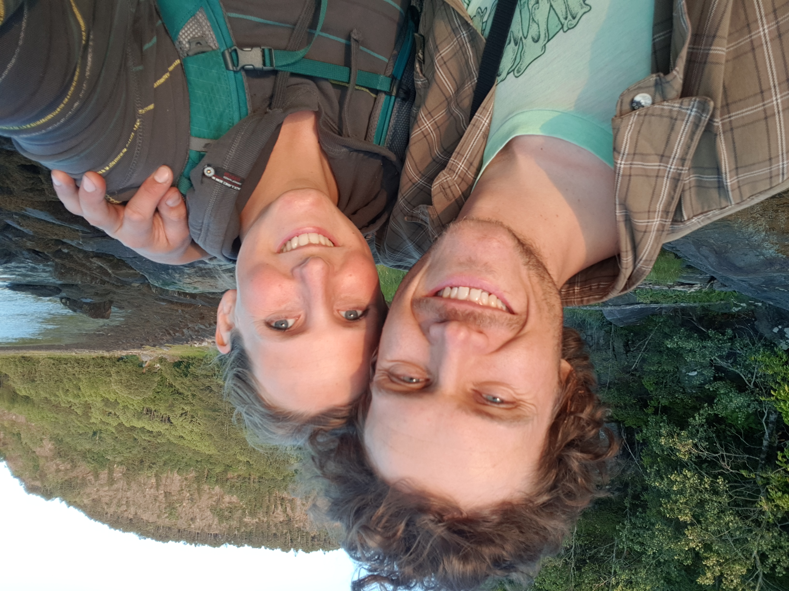{group="par"}

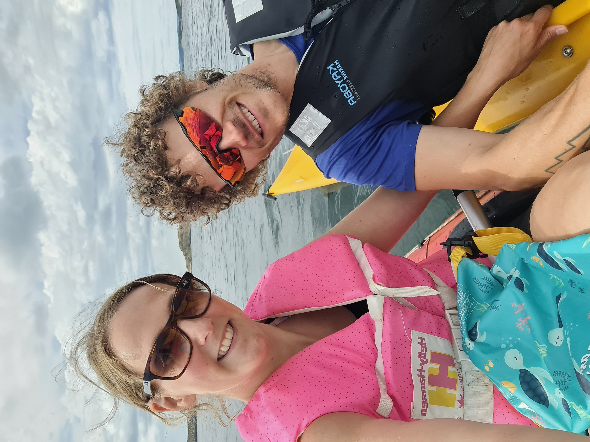{group="par"}


# Om oss {#sec-oss}

Marte og Anders møttes under studiene på Ås, i 2013. Nærmere bestemt under et plantekurs på Kittilbu i Gausdal. 

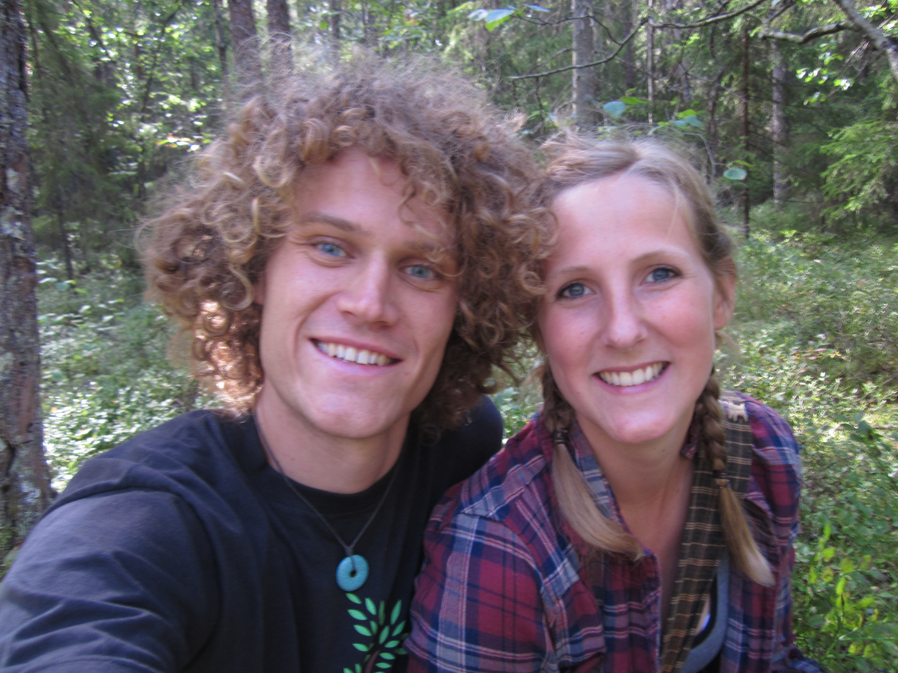{width="50%" group="par" description="Blåbærbilde. Vårt første "parbilde", tatt sensommeren 2014 på Ås, rett etter at vi møttes."}

*Blåbærbildet. Vårt første "parbilde", tatt sensommeren 2014 på Ås, rett etter at vi møttes.*

<br>

Samme vinteren dro Marte på utveksling til Cairns, Australia. Det var tilfeldigvis til samme by hvor Anders var på utveksling året før! Dette var på starten av mastergraden til Marte, og den påfølgende (norske) sommeren dro hun til Borneo for å gjøre feltarbeid. På slutten av sommeren kom Anders og møtte henne der. Da hadde det gått ca 8 måneder siden sist vi så hverandre. Siden den gang har vi bodd sammen hele tiden.

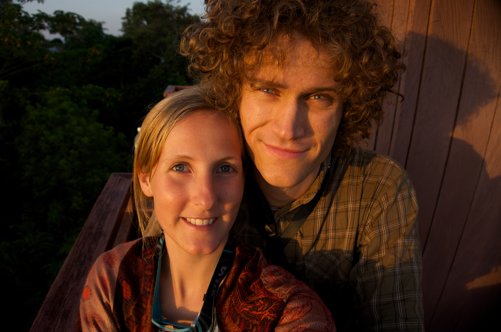{width="50%" group="par" description="Marte og Anders på Borneo."}

*Marte og Anders på Borneo.*

<br>

Etter avsluttet masterutdanning ved Ås flyttet vi til Trondheim, og Byåsen. Der fikk vi begge jobb ved NTNU Vitenskapsmuseet, i samme etasje til og med. Etter ett år flyttet vi til Byneset utenfor Trondheim, og der bodde vi da Eilif ble født, 24. mars 2019.

{width="50%" description="Eilif som nyfødt."}

*Eilif som nyfødt.*

<br>

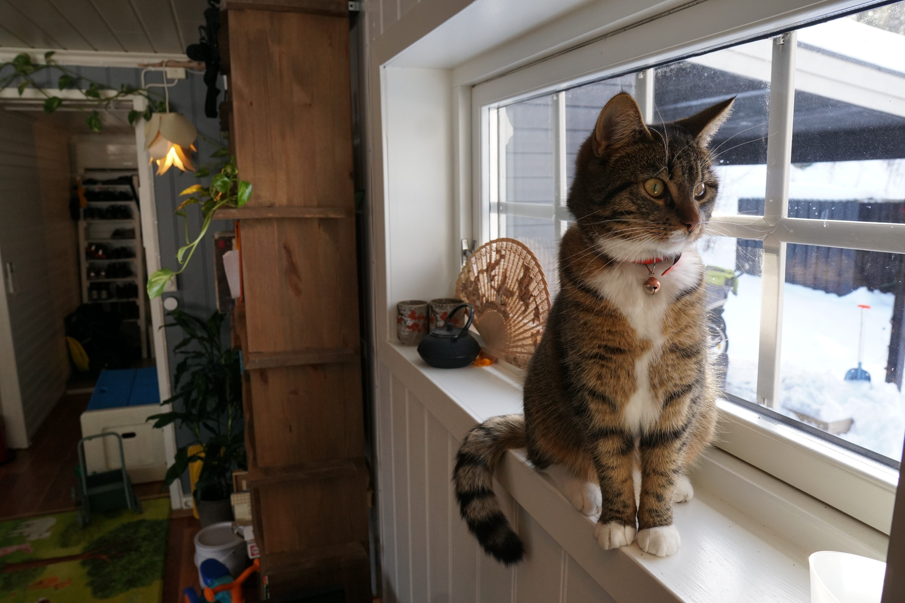{width="50%" description="Når vi flytte til Lian fikk vi også to katttunger. Her er Erica."}

*Da vi flyttet til Lian fikk vi også to katttunger. Her er Erica.*

<br>

Under foreldrepermisjonen dro vi på en 3 måneders tur til Australia og New Zealand. Når vi kom hjem hadde vi kjøpt hus (kjøpt rett før og overtatt mens vi var på reise). Vi flytta så inn på Lian, i det huset hvor vi fortsatt bor. Så startet covid-epidemien, og vi var veldig fornøyd med å ha flytta til "bøgda i byen".

{width="50%" description="På reise i New Zealand."}

*På reise i New Zealand.*

<br>

Ylva ble så født 16. oktober 2022. Nå var vi blitt fire. 

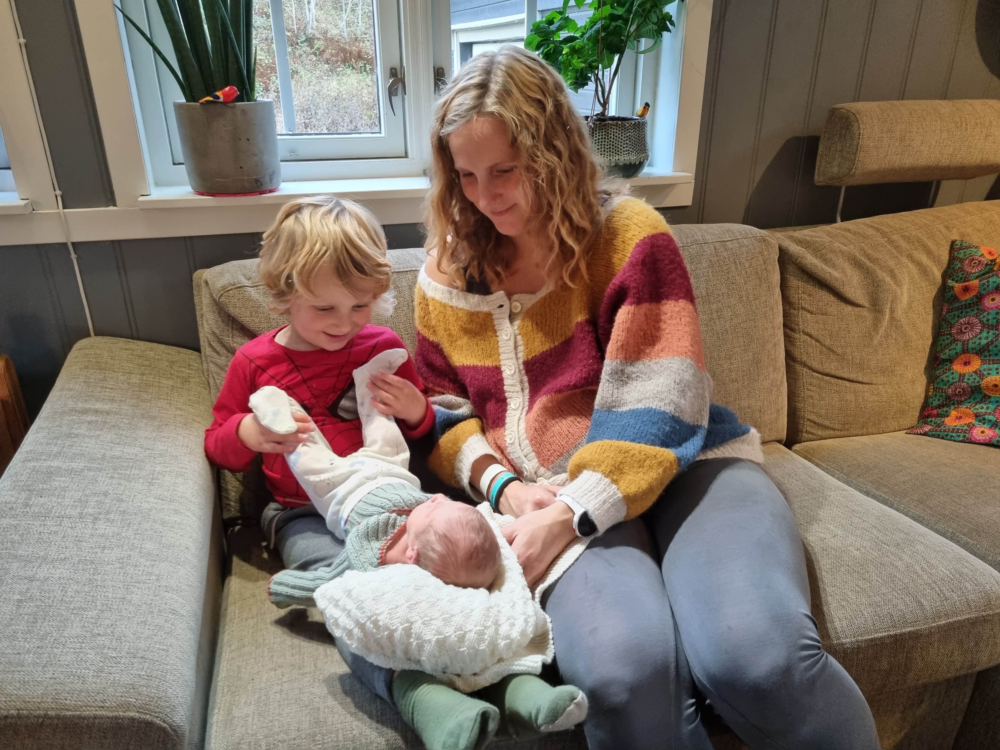{width="50%" description="Ylva, mamma og storebror Eilif."}

*Ylva, mamma og storebror Eilif.*

<br>

Tradisjon tro dro vi på en ny tur i foreldrepermisjonen. Denne gang til Sør-Europa. Nå venter nye turer, opplevelser, og fine hverdager. 

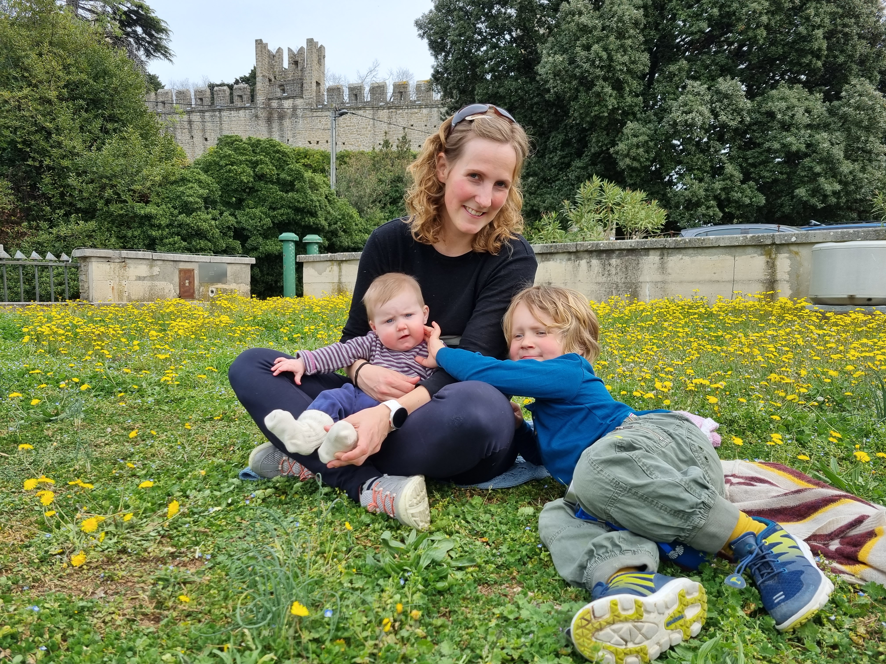{width="50%" description="Familien på tur på Balkan."}

*Familien på tur på Balkan.*

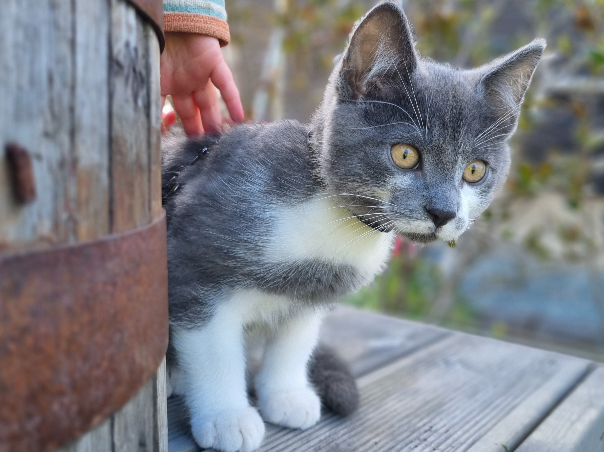{width="50%" description="Nimbus er familiens siste medlem."}

*Nimbus er familiens siste medlem*

<br>

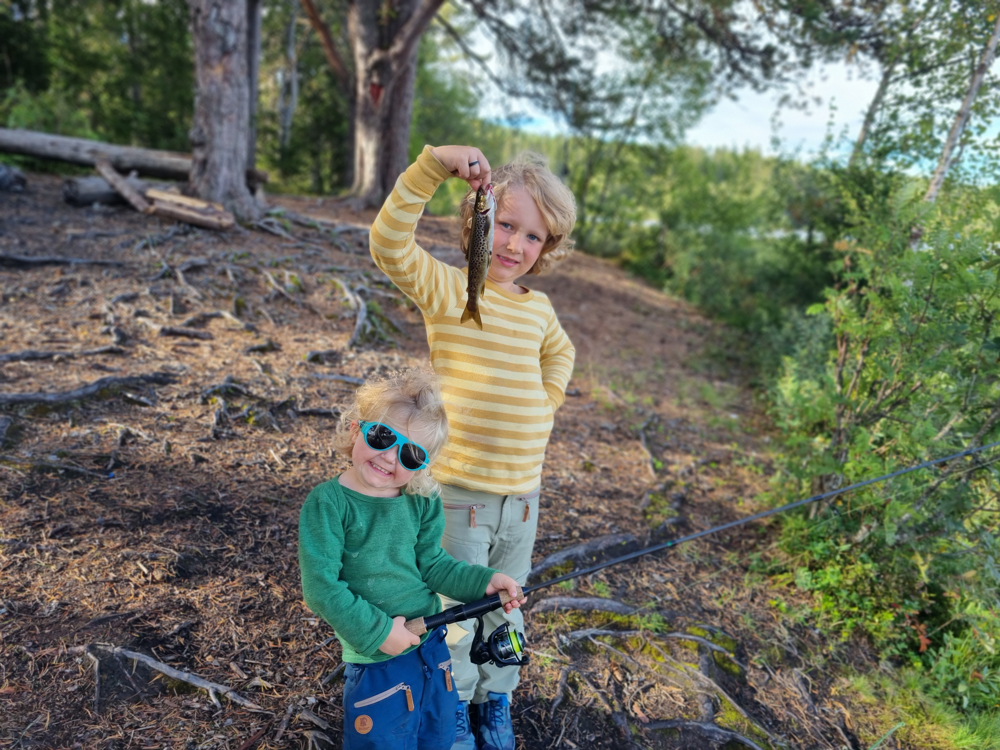{width="50%" description="Eilif og Ylva på fisketur i Lianvannet, 2025."}

*Eilif og Ylva på fisketur i Lianvannet, 2025.*

<br>

**Vi flytter**. Vi har kjøpt oss et lite småbruk på Fåvang, og flytter dit i sommerferien. Vi gleder oss veldig til dette nye prosjektet og eventyret, men kommer også til å savne Lian og Trondheim.

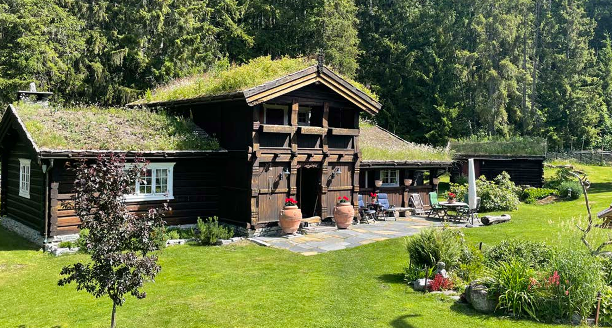{width="80%" description="Vårt nye hus på Fåvang. Velkommen på besøk!"}

*Vårt nye hus på Fåvang. Velkommen på besøk!*

<br>

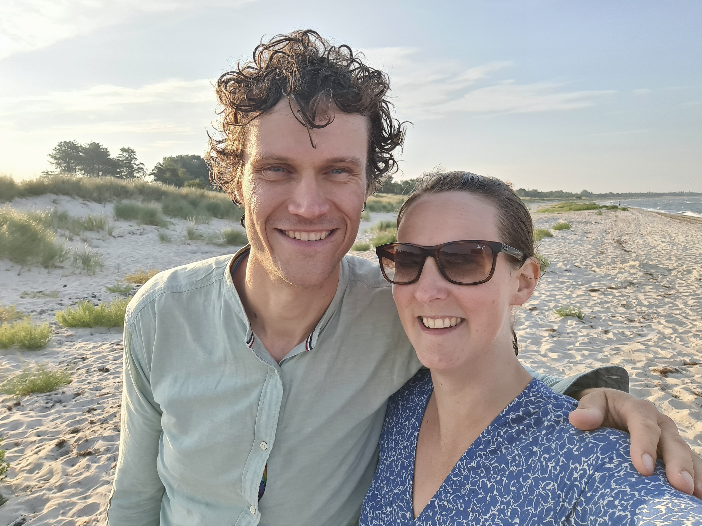{group="par" description="Brudeparet."}

*Brudeparet.*


# Lokalet

## Row

```{r}
#| title: "Kart"
library(leaflet)

leaflet() %>%
  addTiles() %>% # Add default OpenStreetMap map tiles
  addMarkers(lat=63.4002449379497, lng=10.351513488075847, popup="Ferstad gård") |>
  addMarkers(lat=63.39882797941568, lng=10.310960484775396, popup="Huset vårt")
```

## Row

### Column {width="50%"}
Bryllupet holdes på Ferstad Gård på Byåsen i Trondheim. Gården er lett tilgjengelig via trikken som går mellom Ila og Lian. Trikkestoppet heter Ferstad. Seremonien blir utendørs, så tenk på å ha noe litt varmere klær til å ha over om vårvarmen ikke er helt tilstede. Middag og fest skal være inne på selskapslokalet "Låven", kort tid etter seremonien. Til tross for navnet er dette et oppvarmet innelokale med normal innetemperatur.


### Column {width="50%"}

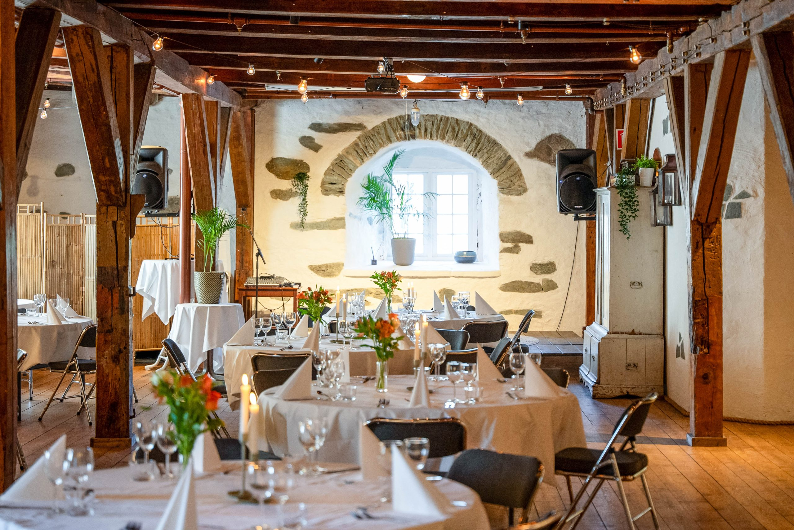

<https://ferstadgaard.no/>


# Fredagen

Dagen før bryllupet inviterer vi til en uformell grilling ved Lianvannet fra kl 17. Ta med egen mat og drikke, så stiller vi med grill, salat og potetsalat.
Ved dårlig vær flytter vi inn i hytta som så vidt kan ses ved vannkanten til høyre i bildet, eventuelt til BUL-hytta som er litt sørre, men ligger litt lengre unna. 

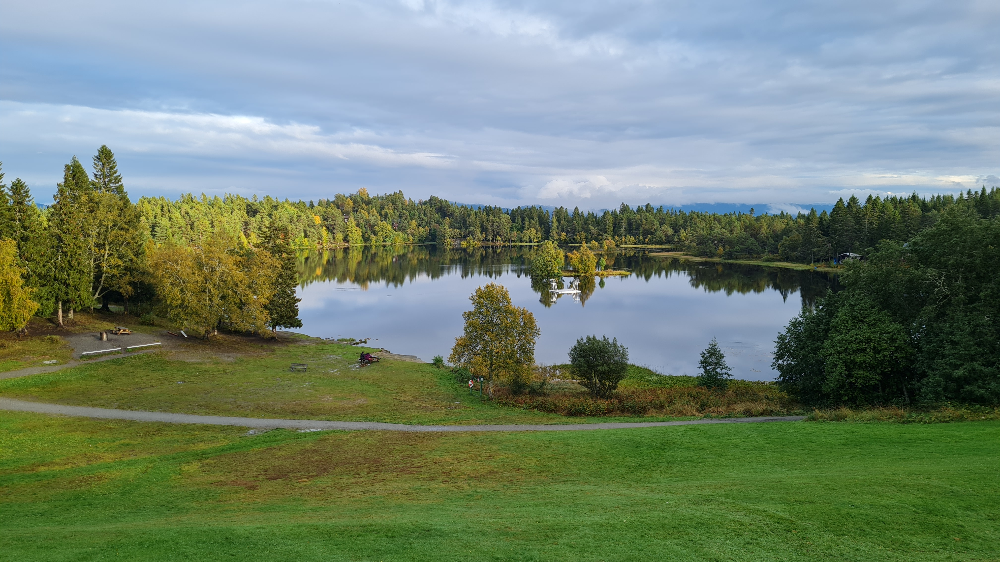{description="Lianvannet"}

*Lianvannet*


# Søndagen

Det blir mulig å samles også på søndagen for å spise litt mer kake og sladre litt om kvelden før. Om været holder inviterer vi hjem i hagen på Lian fra ca kl 13. Send gjerne en melding eller ring Anders på 98862790, så får dere høre hva som skjer :p 

# Overnatting og transport

Ferstad Gård ligger lett tilgjengelig fra Ferstad trikkestopp og er slik sett tilgjengelig både fra hoteller i byen eller andre overnattingsmuligheter, f.eks. Airbnb, som finnes langs trikkelinja. På Lian er det også noen rom og hytter tilgjengelige. Ta gjerne kontakt med oss for hjelp og råd til å finne overnatting.

For å benytte kollektivtransport i Trondheim, brukes appen AtB.
Trikkene til Lian går hvert kvarter i rushtid, og hver halvtime på kveldstid. Det går også natt-trikk: kl 01.48 og 02.48 mot sentrum på lørdagen, tilsvarende mot Lian kl. 01.31 og 02.31. 

# Gaveønsker {#sec-gaver}

Det vi ønsker oss aller mest er å se flest mulig av dere alle sammen i bryllupet. At dere blir med på festen er gave nok!

Så vet vi at noen likevel ønsker å gi oss noe, og derfor har vi laget en liten liste over ting vi ønsker oss. 

- en donasjon til [Leger uten grenser (_doctors without borders_)](https://legerutengrenser.no/). Dette setter vi øverst på lista, og det er noe vi blir veldig glade for!
- Bidrag til reise. Vi tenker oss ut på en lengre tur igjen om ikke så alt for lenge, men vi vet enda ikke helt hvor eller når. Kontonummer: 6636 13 62188.
- sengesett i naturmaterialer
- laken 180 cm og 90 cm
- [Le Creuset kasserolle 1,5 liter](https://www.lecreuset.no/no_NO/p/kasserolle-stopejern/CI1181.html?dwvar_CI1181_color=volcanic&dwvar_CI1181_size=16cm-l1-5)
- [Le Creuset gryte 3,3 liter](https://www.lecreuset.no/no_NO/p/rund-gryte-stopejern/CI1177.html?dwvar_CI1177_color=volcanic&dwvar_CI1177_size=22cm-l3-3)
- Bidrag eller brukt utstyr til hønsegård. Kontonummer: 6636 13 62188.
- Stavmikser
- Vinglass, for eksempel en [all-round variant](https://www.hadeland.com/products/allround-56-cl-6-pk)
- [Ølglass - AUgustin pilsglas](https://www.hadeland.com/products/pils-46-cl-2pk)
